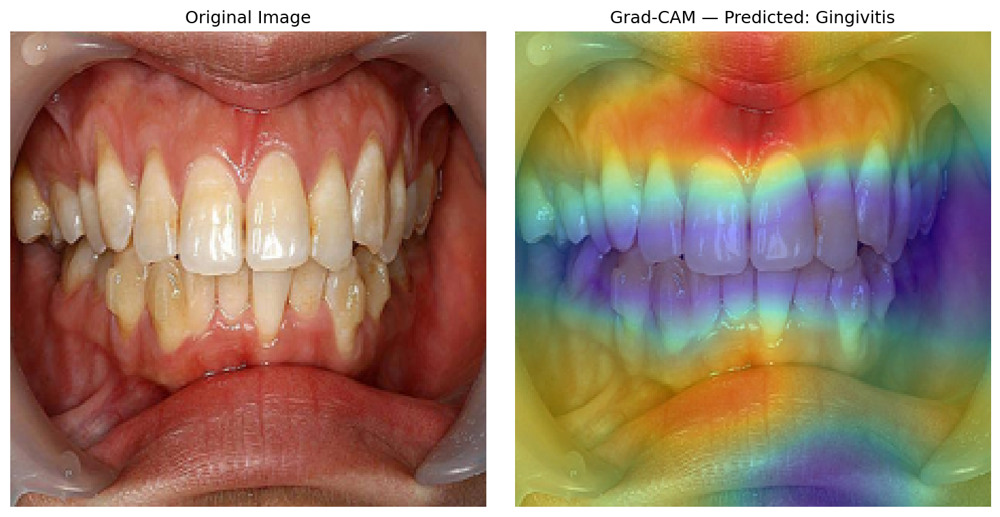
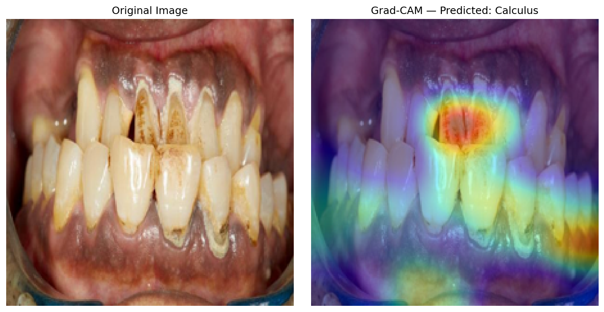
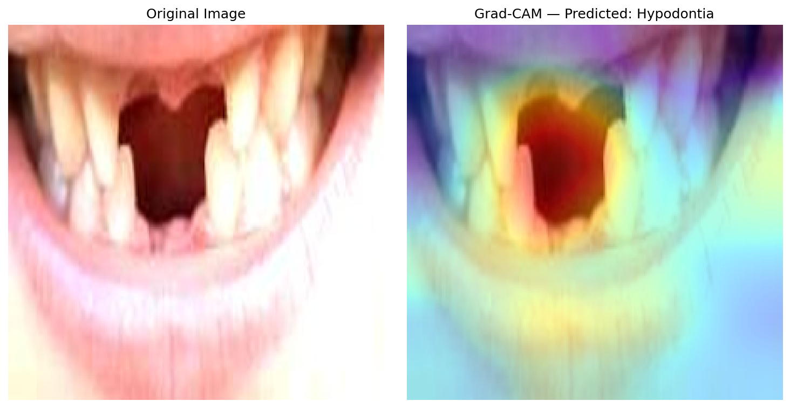

# 🦷 Oral Disease Image Classification

An end-to-end deep learning system that classifies oral cavity images into six disease categories using a custom CNN and three transfer learning architectures, deployed as an interactive web application.

## 🚀 Live Demo

[Add your Hugging Face Spaces link here once deployed]


---

# Overview

This project builds, compares, and deploys an AI system that classifies oral cavity images into six categories:

- Caries
- Gingivitis
- Mouth Ulcer
- Tooth Discoloration
- Calculus
- Hypodontia

Four deep learning models were trained and evaluated:

1. Custom CNN
2. ResNet50
3. EfficientNetB0
4. MobileNetV2

The best-performing model (**EfficientNetB0**) was selected and deployed through a Gradio interface that predicts oral disease categories from uploaded images.

---

# Dataset

- **Source:** [Oral Diseases Dataset - Kaggle](https://www.kaggle.com/datasets/salmansajid05/oral-diseases)
- **Classes:** 6
- **Total images used:** 5,563 original images
- **Train / Validation / Test split:** 70% / 15% / 15%

The dataset contains:

| Class | Train | Validation | Test |
|---|---:|---:|---:|
| Gingivitis | 1644 | 352 | 353 |
| Calculus | 907 | 194 | 195 |
| Hypodontia | 875 | 187 | 189 |
| Mouth Ulcer | 185 | 39 | 41 |
| Caries | 153 | 32 | 34 |
| Tooth Discoloration | 128 | 27 | 28 |

The dataset contains class imbalance, especially between Gingivitis and Tooth Discoloration.
To address this issue, class weights were calculated and applied during training.

---

# Methodology

## Preprocessing & Data Augmentation

All images were resized to:

```
224 × 224 pixels
```

Training images were augmented using:

- Rotation
- Width and height shift
- Shear transformation
- Zoom
- Horizontal flip
- Brightness variation

Each transfer learning model used its own architecture-specific preprocessing function:

- ResNet50 → `preprocess_input`
- EfficientNetB0 → `preprocess_input`
- MobileNetV2 → `preprocess_input`

This was critical because different pretrained architectures expect different input normalization.

---

# Models Trained

## 1. Custom CNN

A convolutional neural network built from scratch containing:

- 4 convolutional blocks
- Batch normalization
- Max pooling layers
- Global average pooling
- Dropout regularization

The model was trained from scratch without pretrained weights.

## 2. ResNet50

- ImageNet pretrained model
- Frozen convolutional base
- Custom classification head added for six classes

## 3. EfficientNetB0

- ImageNet pretrained model
- Feature extraction approach
- Custom classification head
- Selected as the final deployed model

## 4. MobileNetV2

- Lightweight ImageNet pretrained architecture
- Frozen feature extractor
- Custom classification head

All models were trained using:

- Adam optimizer
- Categorical Cross-Entropy loss
- EarlyStopping callback
- ReduceLROnPlateau callback

---

# Fine-Tuning Experiment

Fine-tuning was tested on EfficientNetB0 by unfreezing the last 30 layers and training with a low learning rate:

```
Learning Rate = 1e-5
```

However, performance decreased:

| Approach | Validation Accuracy |
|---|---:|
| Feature Extraction | 78.9% |
| Fine-Tuning | 76.4% |

The decrease was likely caused by the limited dataset size, where updating additional parameters negatively affected pretrained ImageNet features.

Therefore, the original feature extraction EfficientNetB0 model was selected as the final model.

---

# Results

## Model Comparison

| Model | Test Accuracy | Macro F1 |
|---|---:|---:|
| **EfficientNetB0** | **81.07%** | **0.80** |
| ResNet50 | 79.88% | 0.80 |
| MobileNetV2 | 77.74% | 0.76 |
| Custom CNN | 72.14% | 0.69 |

EfficientNetB0 achieved the best overall performance and provided the best balance between accuracy and model size.

## Per-Class Performance (EfficientNetB0)

| Class | Precision | Recall | F1-score |
|---|---:|---:|---:|
| Hypodontia | 0.98 | 0.93 | 0.95 |
| Mouth Ulcer | 0.93 | 0.98 | 0.95 |
| Gingivitis | 0.85 | 0.76 | 0.80 |
| Tooth Discoloration | 0.68 | 0.82 | 0.74 |
| Calculus | 0.65 | 0.78 | 0.71 |
| Caries | 0.65 | 0.65 | 0.65 |

---

# Key Findings

## Transfer Learning Advantage

Transfer learning improved performance compared with the custom CNN by 5–9 percentage points across all pretrained architectures. This confirms that ImageNet pretrained features are useful even for medical image classification tasks.

## Importance of Correct Preprocessing

A preprocessing mismatch caused major performance degradation. Using `rescale = 1./255` with ResNet50 reduced accuracy to approximately 30%. After applying the correct architecture-specific preprocessing function, performance returned to expected levels.

## Why Accuracy Tops Out Around 81%

Three compounding factors limit ceiling performance on this dataset:

1. **Limited dataset size** — roughly 3,900 training images across 6 classes, with as few as 128–219 original images for the weakest classes, well below the scale typically used in published medical imaging models.
2. **Genuine visual overlap between classes** — most notably Calculus and Gingivitis, which both present near the gumline (confirmed by Grad-CAM below).
3. **Unstandardized image sources** — the dataset combines images with varying camera angles, lighting, and quality, unlike clinically standardized capture protocols.

Given these constraints, 81% test accuracy with a macro F1 of 0.80 is a reasonable and defensible result, comparable to accuracy ranges commonly reported for fine-grained medical image classification tasks.

The most common confusion occurred between **Calculus and Gingivitis**, because both affect similar regions around the gumline.

---

# Model Interpretability (Grad-CAM)

To understand whether the EfficientNetB0 model was focusing on clinically meaningful regions, Grad-CAM visualization was applied. Grad-CAM highlights the areas of the image that contributed most to the model's prediction.

## Grad-CAM Observations

| Class | Observation |
|---|---|
| **Gingivitis** | The model focused on the gumline surrounding the teeth, which matches the anatomical location where gingivitis appears. |
| **Calculus** | Attention was distributed across the tooth surface instead of focusing precisely on deposits near the gumline, explaining some confusion with Gingivitis. |
| **Hypodontia** | The model achieved high accuracy, but some attention appeared on image borders and corners, suggesting possible reliance on non-clinical visual cues. |

## Grad-CAM Examples

### Gingivitis


### Calculus


### Hypodontia


## Interpretation

Accuracy alone does not guarantee that a deep learning model is making decisions based on medically relevant features. Grad-CAM helped identify where the model was focusing, potential weaknesses in its reasoning, and future improvement directions such as attention-guided training and collecting more clinical images.

---

# Deployment

The final EfficientNetB0 model was deployed using a Gradio web application. The application allows users to:

1. Upload an oral cavity image.
2. Run inference using the trained model.
3. Receive prediction probabilities for all six disease categories.

Example:

```python
import gradio as gr

interface = gr.Interface(
    fn=predict_disease,
    inputs=gr.Image(type="pil", label="Upload an oral/dental image"),
    outputs=gr.Label(num_top_classes=6, label="Classification Result"),
    title="Oral Disease Classification System"
)
interface.launch(share=True)
```

---

# Installation

Clone the repository:

```bash
git clone https://github.com/Medhat-66/oral-disease-image-classification.git
cd oral-disease-image-classification
```

Install dependencies:

```bash
pip install -r requirements.txt
```

Run the application:

```bash
python app.py
```

---

# Tech Stack

**Deep Learning:** TensorFlow, Keras, Transfer Learning (EfficientNetB0, ResNet50, MobileNetV2)

**Data Processing:** NumPy, Pandas, Scikit-learn

**Visualization:** Matplotlib, Seaborn, Grad-CAM

**Deployment:** Gradio

**Environment:** Google Colab, NVIDIA T4 GPU

---

# Project Structure

```
oral-disease-image-classification/
├── Oral_Diseases_Image_Classification.ipynb
├── app.py
├── gradcam_calculus.png
├── gradcam_gingivitis.png
├── gradcam_hypodontia.png
├── README.md
└── requirements.txt
```

> Note: the trained model file (`efficientnet_model_final.keras`) is hosted on Hugging Face Spaces rather than committed to this repository, since Keras model files typically exceed GitHub's recommended file size limits.

---

# Future Work

- Adding more clinical images to improve generalization.
- Improving performance on minority classes such as Caries and Tooth Discoloration.
- Using higher-resolution image crops around affected regions.
- Exploring ensemble methods between EfficientNetB0 and ResNet50.
- Deploying permanently using Hugging Face Spaces.

---

# Disclaimer

This project is developed for educational and research purposes only. It is **not a medical diagnostic tool** and should not be used as a replacement for professional dental evaluation.

---

# Contact

**Medhat Mohamed**

GitHub: [github.com/Medhat-66](https://github.com/Medhat-66)

---

⭐ If you find this project useful, consider giving it a star.
